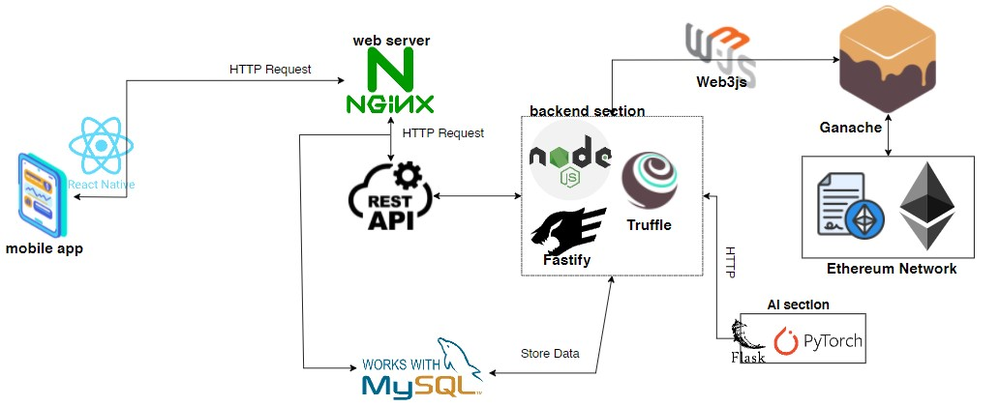
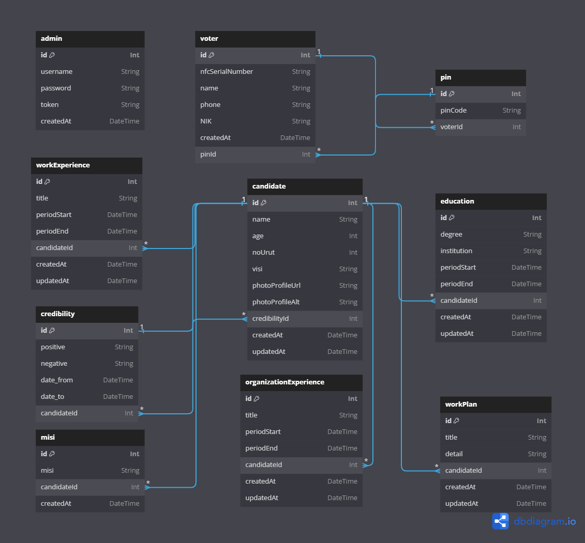

# DOCUMENTATION

## OVERVIEW

SuaraDesamu is mobile application that use blockchain technology for village head elections. With SuaraDesamu app, the risk of vote manipulation or forgery is reduced. This application also ensures the integrity of the election by providing a transparent trail of each vote so that the transparency of the vote is very clear. SuaraDesamu application can also increase voter participation by providing good accessibility, allowing more citizens to participate in the election process.

## [Click here for POSTMAN API DOCUMENTATION](https://documenter.getpostman.com/view/24530478/2sA3XY7dsq)

## ARCHITECTURE SYSTEM



## DATABASE DESIGN



### Tables and Their Relationships

#### admin

- **Columns**: `id`, `username`, `password`, `token`, `createdAt`
- **Description**: Stores information about the admin managing the system. The `username` column is unique to ensure no duplicate admin usernames.

#### voter

- **Columns**: `id`, `nfcSerialNumber`, `name`, `phone`, `NIK`, `createdAt`, `pinId`
- **Relationships**:
  - One `voter` has one `pin` (1-1 relationship with the `pin` table through `pinId`).
- **Description**: Stores information about voters, including their NIK and optional phone number. The `nfcSerialNumber` column is unique.

#### pin

- **Columns**: `id`, `pinCode`, `voterId`
- **Relationships**:
  - One `pin` belongs to one `voter` (1-1 relationship with the `voter` table through `voterId`).
- **Description**: Stores PIN codes for voters. Each PIN is unique and linked to a specific voter.

#### candidate

- **Columns**: `id`, `name`, `age`, `noUrut`, `visi`, `photoProfileUrl`, `photoProfileAlt`, `credibilityId`, `createdAt`, `updatedAt`
- **Relationships**:
  - One `candidate` has one `credibility` (1-1 relationship with the `credibility` table through `credibilityId`).
  - One `candidate` has many `workPlan`, `education`, `workExperience`, `organizationExperience`, and `misi` (1-N relationships with respective tables).
- **Description**: Stores candidate information including profile, vision (visi), and associated credibility.

#### credibility

- **Columns**: `id`, `positive`, `negative`, `date_from`, `date_to`, `candidateId`
- **Relationships**:
  - One `credibility` belongs to one `candidate` (1-1 relationship with the `candidate` table through `candidateId`).
- **Description**: Stores credibility information for candidates, including positive and negative aspects.

#### misi

- **Columns**: `id`, `misi`, `candidateId`, `createdAt`
- **Relationships**:
  - One `misi` belongs to one `candidate` (1-N relationship with the `candidate` table through `candidateId`).
- **Description**: Stores missions of candidates.

#### workPlan

- **Columns**: `id`, `title`, `detail`, `candidateId`, `createdAt`, `updatedAt`
- **Relationships**:
  - One `workPlan` belongs to one `candidate` (1-N relationship with the `candidate` table through `candidateId`).
- **Description**: Stores work plans of candidates.

#### education

- **Columns**: `id`, `degree`, `institution`, `periodStart`, `periodEnd`, `candidateId`, `createdAt`, `updatedAt`
- **Relationships**:
  - One `education` belongs to one `candidate` (1-N relationship with the `candidate` table through `candidateId`).
- **Description**: Stores educational background of candidates.

#### workExperience

- **Columns**: `id`, `title`, `periodStart`, `periodEnd`, `candidateId`, `createdAt`, `updatedAt`
- **Relationships**:
  - One `workExperience` belongs to one `candidate` (1-N relationship with the `candidate` table through `candidateId`).
- **Description**: Stores work experience of candidates.

#### organizationExperience

- **Columns**: `id`, `title`, `periodStart`, `periodEnd`, `candidateId`, `createdAt`, `updatedAt`
- **Relationships**:
  - One `organizationExperience` belongs to one `candidate` (1-N relationship with the `candidate` table through `candidateId`).
- **Description**: Stores organizational experience of candidates.

### Additional Explanation

- The database design is well-normalized with clear relationships between entities.
- Each entity has a specific role:
  - **Admin** for managing the system.
  - **Voter** for storing voter details.
  - **Pin** for storing voter PIN codes.
  - **Candidate** for candidate profiles and related information (credibility, mission, plans, etc.).
- The use of foreign keys ensures data integrity and proper relationships between tables.
- Cascading deletes on foreign key relationships (e.g., `candidate` with `credibility`) ensure that related data is removed appropriately, preventing orphan records.
- Timestamp columns (`createdAt`, `updatedAt`) are used to track record creation and updates, which is good practice for auditing and tracking changes.

## SMART CONTRACT

```solidity
// SPDX-License-Identifier: MIT
pragma solidity ^0.8.4;

contract VotingSystem {
    struct Candidate {
        uint256 id;
        string name;
        uint256 voteCount;
    }

    struct Voter {
        bool hasVoted;
        uint256 candidateId;
        string NIK;
    }

    address public owner;
    uint256 public candidateCount;
    uint256 public voterCount;
    uint public votesCount;
    mapping(uint256 => Candidate) public candidates;
    mapping(address => Voter) private voters;
    mapping(string => bool) private registeredNIKs;
    mapping(string => bool) private usedNIKs;
    string[] public NIKs;

    bool public votingStarted;
    uint public startVotingTime;
    uint public endVotingTime;

    event VotingStarted(uint startTime);
    event VotingEnded(uint endTime);
    event Voted(address voter, uint256 candidateId);

    modifier onlyOwner() {
        require(msg.sender == owner, "Only owner can call this function");
        _;
    }

    modifier notOwner() {
        require(msg.sender != owner, "Owner cannot vote");
        _;
    }

    modifier hasNotVoted() {
        require(!voters[msg.sender].hasVoted, "You have already voted");
        _;
    }

    modifier validNIK(string memory _NIK) {
        require(registeredNIKs[_NIK], "NIK is not registered");
        _;
    }
    modifier isNIKExist(string memory _NIK){
        require(!registeredNIKs[_NIK], "NIK is registered");
        _;
    }

    modifier hasUsedNIK(string memory _NIK) {
        require(!usedNIKs[_NIK],
            "NIK has already been used to vote"
        );
        _;
    }
    modifier validCandidate(uint256 _candidateId){
        require(_candidateId > 0, "Candidate ID must be greater than zero");
        require(
            candidates[_candidateId].id == 0,
            "Candidate with this ID already exists"
        );
        _;
    }
    modifier isCandidateExist(uint256 _candidateId){
        require(
            candidates[_candidateId].id != 0,
            "Candidate with this ID is not exists"
        );
        _;
    }

    modifier checkEndVoting() {
        if (votingStarted && block.timestamp > endVotingTime) {
            votingStarted = false;
            emit VotingEnded(block.timestamp);
        }
        _;
    }
    modifier onlyBeforeVotingStart(){
        require(!votingStarted || block.timestamp < startVotingTime, "Voting has already started");
        _;
    }

    modifier onlyDuringVoting() {
        require(votingStarted && block.timestamp >= startVotingTime && block.timestamp <= endVotingTime, "Voting is not active");
        _;
    }

    modifier onlyAfterVotingEnd() {
        require(votingStarted && block.timestamp > endVotingTime, "Voting has not ended yet");
        _;
    }

    constructor() {
        owner = msg.sender;
    }

    function startVoting(uint256 _duration) public onlyOwner onlyBeforeVotingStart {
        require(_duration > 0, "Duration must be greater than zero");
        votingStarted = true;
        startVotingTime = block.timestamp;
        endVotingTime = block.timestamp + _duration;
        emit VotingStarted(startVotingTime);
    }

    function endVoting() public onlyOwner onlyDuringVoting {
        votingStarted = false;
        emit VotingEnded(block.timestamp);
    }

    function addCandidate(string memory _name, uint256 _candidateId)
        public
        onlyOwner
        onlyBeforeVotingStart
        validCandidate(_candidateId)
    {
        candidates[_candidateId] = Candidate(_candidateId, _name, 0);
        candidateCount++;
    }

    function checkIfNIKNotRegistered(string memory _NIK )public isNIKExist(_NIK){

    }
    function checkIfNIKRegistered(string memory _NIK )public validNIK(_NIK){

    }
    function checkIfNIKHasUsed(string memory _NIK) public hasUsedNIK(_NIK){

    }

    function checkIfCandidateValid(uint256 _candidateId)public isCandidateExist(_candidateId){

    }

    function addNIK(string memory _NIK) public onlyOwner onlyBeforeVotingStart {
        require(bytes(_NIK).length > 0, "NIK is required");
        require(!registeredNIKs[_NIK], "NIK is already registered");
        registeredNIKs[_NIK] = true;
        NIKs.push(_NIK);
        voterCount++;
    }

    function removeNIK(string memory _NIK) public onlyOwner onlyBeforeVotingStart hasUsedNIK(_NIK) validNIK(_NIK) {
        registeredNIKs[_NIK] = false;

        for (uint256 i = 0; i < NIKs.length; i++) {
            if (keccak256(abi.encodePacked(NIKs[i])) == keccak256(abi.encodePacked(_NIK))) {
                NIKs[i] = NIKs[NIKs.length - 1];
                NIKs.pop();
                voterCount--;
                break;
            }
        }
    }

    function vote(uint256 _candidateId, string memory _NIK)
        public
        notOwner
        checkEndVoting
        onlyDuringVoting
        hasNotVoted
        validNIK(_NIK)
        hasUsedNIK(_NIK)
    {
        require(
            _candidateId > 0 && _candidateId <= candidateCount,
            "Invalid candidate ID"
        );

        voters[msg.sender] = Voter({
            hasVoted: true,
            candidateId: _candidateId,
            NIK: _NIK
        });

        candidates[_candidateId].voteCount++;
        usedNIKs[_NIK] = true;
        votesCount++;
        emit Voted(msg.sender, _candidateId);
    }

    function getCandidate(uint256 _candidateId)
        public
        view
        returns (
            uint256,
            string memory,
            uint256
        )
    {
        require(
            _candidateId > 0,
            "Invalid candidate ID"
        );
        Candidate memory candidate = candidates[_candidateId];
        return (candidate.id, candidate.name, candidate.voteCount);
    }

    function getAllCandidates() public view returns (Candidate[] memory) {
        Candidate[] memory candidateList = new Candidate[](candidateCount);
        for (uint256 i = 1; i <= candidateCount; i++) {
            candidateList[i - 1] = candidates[i];
        }
        return candidateList;
    }

    function getVoter()
        public
        view
        returns (
            bool,
            uint256,
            string memory
        )
    {
        Voter memory voter = voters[msg.sender];
        return (voter.hasVoted, voter.candidateId, voter.NIK);
    }

    function getAllNIKs() public view returns (string[] memory) {
        return NIKs;
    }

    function getVoterCount() public view returns (uint256) {
        return voterCount;
    }

    function getVotesCount() public view returns (uint256){
        return votesCount;
    }

    function getVotingStatus() public view returns (bool, uint, uint){
        return (votingStarted, startVotingTime, endVotingTime);
    }

    function checkIsVotingEnd() public {
        if (votingStarted && block.timestamp > endVotingTime) {
            votingStarted = false;
            emit VotingEnded(block.timestamp);
        }
    }

}
```

### Main Component:

- Owner: Addresses the contract owner who has the right to start and end voting, as well as add candidates and Voter IDs.
- Candidates: A structure that stores candidate information including id, name, and number of votes.
- Voters: A structure that stores voter information including the status of whether they have voted, the id of the selected candidate, and the voter's NIK.
- Voting Status: Voting status including start time and end time.
- NIKs: List of NIKs that are registered to participate in voting (NIK that is registered will be hashed before it is saved in block).
- Vote Count: The total number of votes that have been cast.

### Main Process Flow:

- NIK Registration: Owner registers the voter's NIK before voting starts (NIK that is registered will be hashed before it is saved in block).
- Candidate Addition: Owner adds a candidate before voting starts.
- Start Voting: The owner starts the voting with a certain duration.
- Voting Process: Voters cast their vote for a specific candidate using their registered Voter ID.
- Ending Voting: The owner ends the voting.

## SECURITY

- Use Json Web Token
- Use SHA-256 for Hashing NIK data
- Use AES-256-CBC for Encrypting Transaction Hash. Use user E-KTP for the key
- Use CORS

## ALGORITHM
